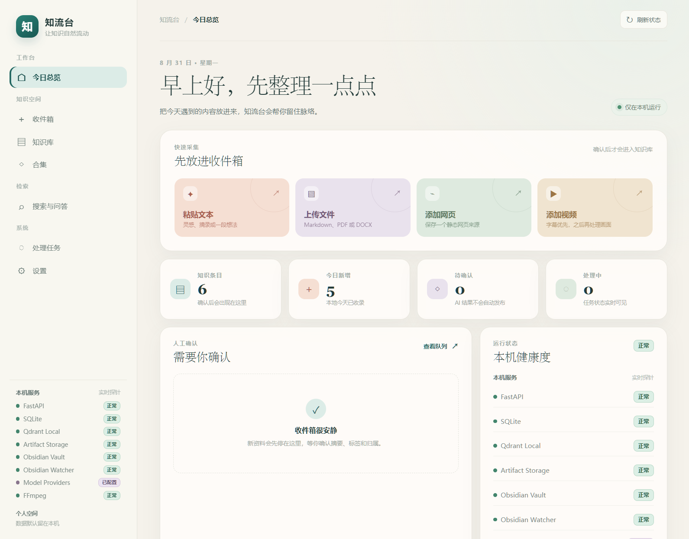
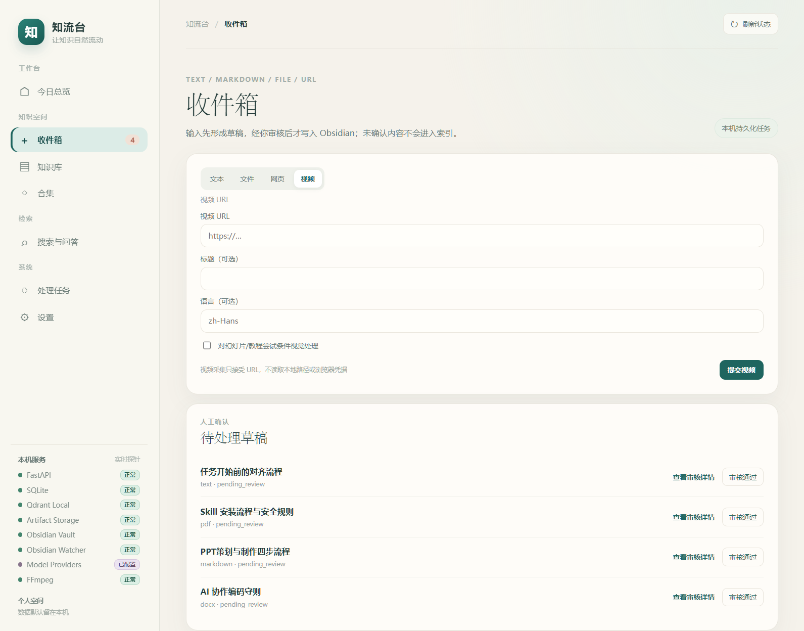
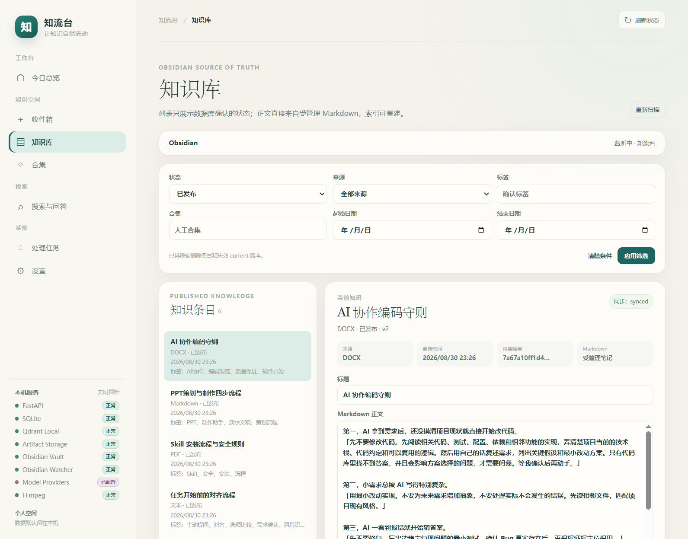
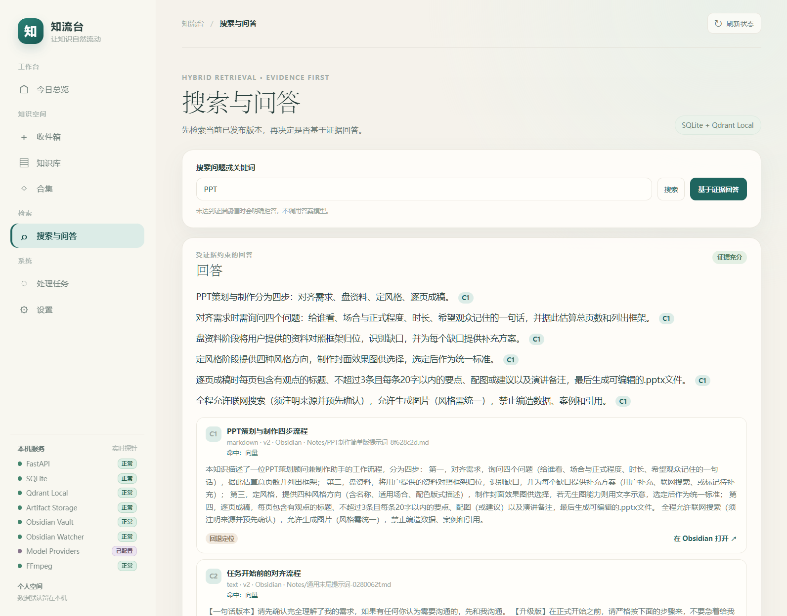
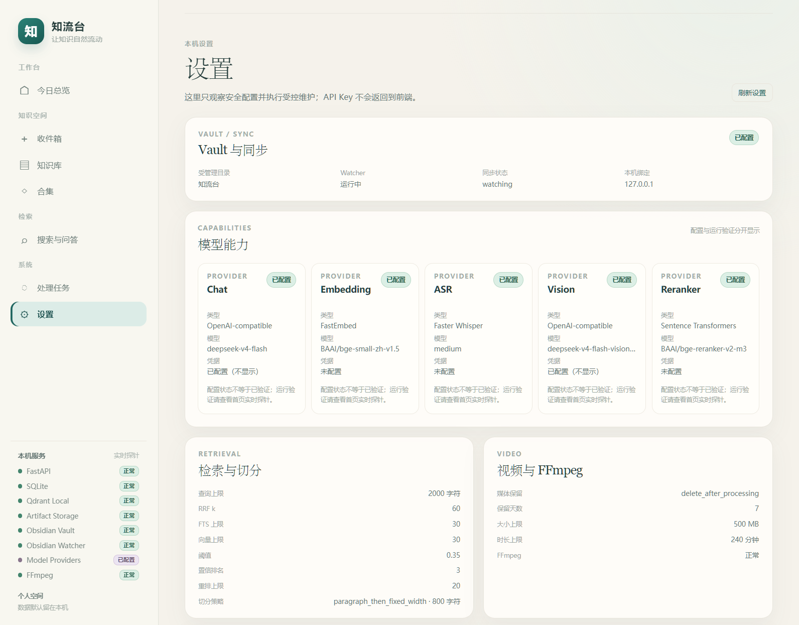
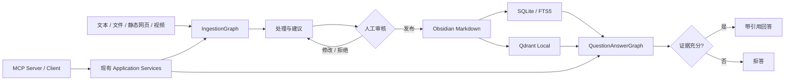

# 知流台

> 让零散信息经过采集、整理、人工确认和检索，沉淀为真正属于自己的本地知识库。

知流台是一个单用户、本机优先的个人知识工作台。它把文本、文档、静态网页和视频送入统一处理流程，在人工确认后发布到 Obsidian，并提供混合检索、带引用问答、合集管理、任务追踪、备份恢复和 MCP 接入。



## 核心能力

- **统一采集**：支持粘贴文本、Markdown、TXT、PDF、DOCX、静态网页 URL 和视频 URL；文件入口支持拖放、多文件队列、去重、取消和部分失败处理。
- **人工确认**：AI 生成的正文、摘要、标签和合集建议先进入待审核区。用户可以编辑、通过、拒绝、取消或发布，系统不会绕过人工确认。
- **Obsidian 主来源**：发布后的知识正文唯一写入 Obsidian Markdown。SQLite 保存关系、任务、引用和运行元数据，Qdrant Local 只保存可重建向量。
- **知识库与合集**：按状态、来源、标签、合集和日期筛选；支持详情编辑、哈希冲突保护、重新处理、软删除，以及合集与 Markdown Frontmatter 双向收敛。
- **证据优先问答**：SQLite FTS5 与 Qdrant Local 混合召回，经过版本权威复核、可选重排和证据门槛后生成答案；引用可定位到当前有效知识版本，证据不足时拒答。
- **视频理解**：以 `yt-dlp + FFmpeg` 处理公开、无需登录或 Cookie 的视频来源，可组合字幕、ASR 和受控关键帧 Vision。媒体下载继续经过 SSRF、DNS、大小和超时边界。
- **任务与恢复**：展示处理进度、heartbeat、耗时、尝试历史和脱敏错误，并支持重试、取消、checkpoint/resume、备份、恢复和派生索引重建。
- **MCP 接入**：Provider 提供 `add_text`、`add_url`、`search_knowledge`、`get_item`、`list_collections`；Consumer 只连接用户明确配置的受信 Server。

## 工作台预览

| 收件箱：采集、任务状态与待审核草稿 | 知识库：筛选、详情和 Obsidian 同步 |
| --- | --- |
|  |  |

| 搜索与问答：证据门槛和可追溯引用 | 设置：只读、脱敏的本机能力状态 |
| --- | --- |
|  |  |

## 工作方式



两个 LangGraph 只负责路由、HITL、checkpoint 和恢复，采集、发布、索引、RAG、Citation 与 Provider 规则仍由普通 application service 统一实现。Graph 和 MCP 不会形成第二套业务逻辑。

## 本地快速开始

环境要求：

- Python 3.12 与 [uv](https://docs.astral.sh/uv/)
- Node.js 与 npm
- Obsidian Vault（需要发布和同步时）
- FFmpeg（需要视频处理时）

在仓库根目录执行：

```powershell
Copy-Item .env.example .env
uv sync --project backend --locked
uv run --directory backend alembic upgrade head
npm --prefix frontend ci --ignore-scripts --no-audit --no-fund
```

根据需要编辑项目根目录 `.env`。至少配置 `VAULT_PATH` 才能发布到 Obsidian；API Key 只保存在 `.env`，不要写入前端、Markdown 或提交记录。

分别启动后端和前端：

```powershell
# 终端 1
uv run --directory backend uvicorn app.main:app --reload --host 127.0.0.1 --port 8000

# 终端 2
npm --prefix frontend run dev
```

本地开发不依赖 Docker、PostgreSQL、Redis、Celery 或独立 Qdrant Server。所有服务默认只绑定 `127.0.0.1`。

## 本机数据与模型

默认本机目录均被 Git 忽略，也可以通过环境变量覆盖：

| 内容 | 默认位置 | 定位 |
| --- | --- | --- |
| SQLite / FTS5 | `data/zhiliutai.db` | 关系、任务、引用、运行与检索元数据 |
| Qdrant Local | `data/qdrant/` | 可重建向量 |
| Artifact | `data/artifacts/` | 原件与可重建处理产物 |
| 模型缓存 | `data/models/` | FastEmbed、ASR、Reranker 等本地模型 |
| 备份 | `data/backups/` | 受控备份归档 |

Chat、Embedding、ASR、Vision 和 Reranker 是独立 capability：

- Chat 与 Vision 可使用 OpenAI-compatible Provider。
- Embedding 默认可使用 FastEmbed 与 `BAAI/bge-small-zh-v1.5`。
- ASR 可使用 `faster-whisper`；设备设为 `auto` 时优先使用可用 CUDA，失败时退回 CPU。
- Reranker 可使用本机 Sentence Transformers。
- 本地模型按需懒加载；启动和健康探针不会主动下载模型。

设置页只展示脱敏状态，不接收或返回 API Key、Provider base URL、绝对 Vault 路径或任意本地路径。

## MCP

启动受控 stdio MCP Provider：

```powershell
uv run --directory backend python -m app.mcp.server
```

MCP Consumer 使用显式 `MCPServerProfile` 和可信入口注册表，只连接用户配置的 Server；模型不能提交 command、路径、endpoint 或任意 shell，也不会触发开放式自动工具循环。

## 备份、恢复与重建

备份可在工作台设置页创建。恢复必须在 FastAPI、JobRunner、Obsidian watcher 和 checkpoint 使用者全部停止后，通过短生命周期 CLI 执行：

```powershell
uv run --directory backend python ../scripts/zhiliutai_backup.py --help
```

恢复默认拒绝覆盖现有目标，归档不能位于数据库、Artifact 或受管理 Vault 目标内部。Qdrant、FTS5 和其他派生索引可以在受控 Embedding capability 可用时从 Markdown、Artifact 与 SQLite 权威关系重建。完整演练见 [测试说明](docs/TESTING.md)。

## 验证

```powershell
uv lock --project backend --check
uv run --directory backend ruff check app tests
uv run --directory backend pytest
npm --prefix frontend run typecheck
npm --prefix frontend run test
npm --prefix frontend run build
npm --prefix frontend run e2e:typecheck
npm --prefix frontend run e2e
git -c safe.directory=D:/Work/zhiliutai -C D:/Work/zhiliutai diff --check
```

GitHub Actions 分别执行 backend、frontend、Docker 和 Playwright Job。自动化只使用临时 Vault、临时数据库、Qdrant Local、合成 fixtures、MockTransport、确定性 Provider 和受控本地 MCP Server，不访问真实用户数据或真实模型密钥。

## 安全边界

- `.env`、API Key、真实 Vault、SQLite、Qdrant 和 Artifact 不进入 Git。
- 不读取浏览器 Cookie，不绕过登录、付费墙、DRM、平台权限或反自动化限制。
- URL 和视频请求执行 SSRF、DNS 重绑定、重定向、大小、连接数、响应字节数和超时限制。
- 任意文件路径都要经过授权根目录和相对路径规范化；API、日志、错误、checkpoint、MCP 和 Markdown 不暴露真实绝对路径或内部 traceback。
- Qdrant 不是版本权威；检索和回答最终由 SQLite 复核 published、current 和非删除状态。
- Citation 必须属于当前回答与 ModelRun，并对应当前有效 Chunk、ContentVersion 和 KnowledgeItem。

## 项目状态与文档

阶段 0–6 已完成，阶段 6 最终结论为 **PASS WITH NON-BLOCKING RISKS**。自动化覆盖完整合成闭环；真实模型、网页、视频平台和外部 MCP 的互操作仍取决于本机配置和第三方服务能力。

- [产品与架构基线](docs/PROJECT.md)
- [系统架构](docs/ARCHITECTURE.md)
- [当前状态](docs/STATUS.md)
- [测试策略与门禁](docs/TESTING.md)
- [架构决策](docs/DECISIONS.md)
